# Generating Game Levels
In this blog, we explore using Generative Adversarial Networks (GANs) to create new synthetic game levels which can be used to train an agent to play the game through Reinforcement Learning (RL). Prior work in generating game levels using GANs (see Fig. 1) has focused on generating levels that look like real game levels and are playable. However we focus on testing if these game levels can also be used to train an RL agent and possibly help the RL agent in learning a better generalized policy for playing the game.

<b>Fig. 1.</b> GAN generated levels [1]:  
     

\[1] Torrado, R. R., Khalifa, A., Green, M. C., Justesen, N., Risi, S., & Togelius, J. (2020, August). Bootstrapping conditional gans for video game level generation. In 2020 IEEE Conference on Games (CoG) (pp. 41-48). IEEE.

## Real Lunar Lander v2 Level
In our implementation we use the LunarLander-v2 gym environment provided by [openai](https://gym.openai.com/envs/LunarLander-v2/). The game randomly generates a level each time it is loaded. Each level is characterized by **11 points** as shown below in Fig. 2. The **terrain points** are evenly distributed horizontally along the width of the level. The height of each point (except for points in the landing zone) is uniformly sampled from **\[0, 6.66)**. The landing zone is defined by 3 points in the middle each at a height of **3.33**. 

<b>Fig. 2.</b> Original Lunar Lander level: 
    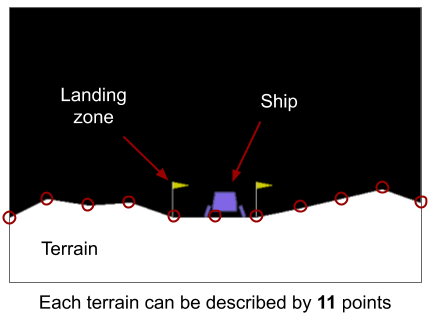

## Modified Lunar Lander v2 Level
The original game is fairly simple for an agent to learn a decent policy as the landing zone is always in the center and the ship always starts at the top rigt above the landing zone. Even though the ship is given an initial displacement to the left or right, the terrain peaks are not high enough to be obstacles for the ship. Moreover as the height of the terrain points are randomly sampled, there is not much of a distribution for a GAN to learn. Therefore we modify the terrain points such that the heights of the points are sampled from a Gaussian distribution with **mean = 9** and **standard deviation = 2**.

<b>Fig. 3.</b>Modified Lunar Lander level: 

    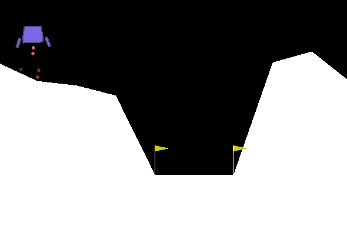

This ensures that the "real" lunar lander levels have a specific underlying distribution that the GAN would be expected to learn and it makes the levels more difficult for an RL agent to learn a decent policy for landing in the landing zone.

## Unrolled GANs
As the distribution of modified real samples is simple (Gaussian), we use a simple GAN architecture with fully connected layers as shown in Fig. 4.

<b>Fig. 4.</b> GAN architecture: 

    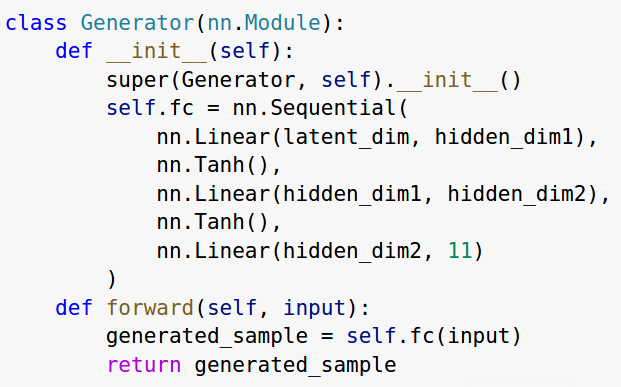 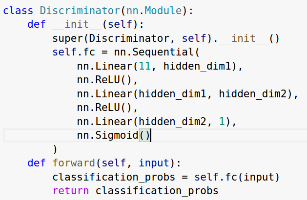

However GANs can suffer from **mode collapse** where the generator produces the same or similar output for any noise input. We also faced the same problem when using vanilla GANs, therefore we used the following solutions: 1) Increase the size of the latent dimension, 2) Using **Unrolled GANs** (see Fig. 5.)

    <b>Fig. 5.</b> Unrolled GANs [2]: 

    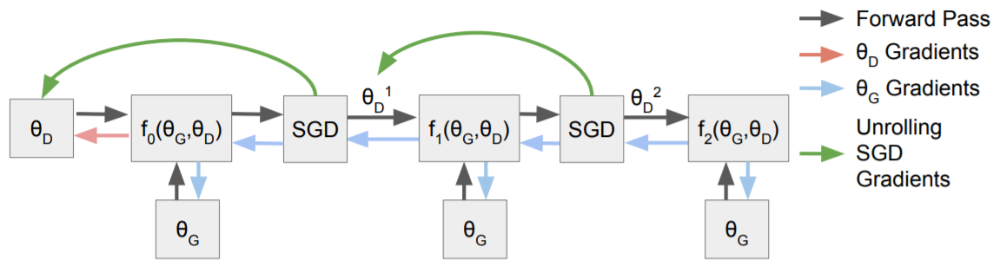

    \[2] Metz, L., Poole, B., Pfau, D., & Sohl-Dickstein, J. (2016). Unrolled generative adversarial networks. arXiv preprint arXiv:1611.02163.

## Generated levels:
The levels generated by Unrolled GANs are much more diverse and closely match the underlying distribution.

    <b>Fig. 6.</b> Example levels generated from UGAN: 
    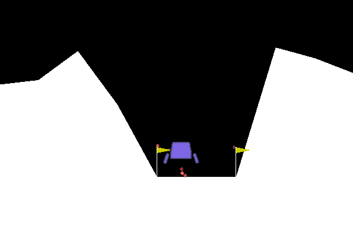 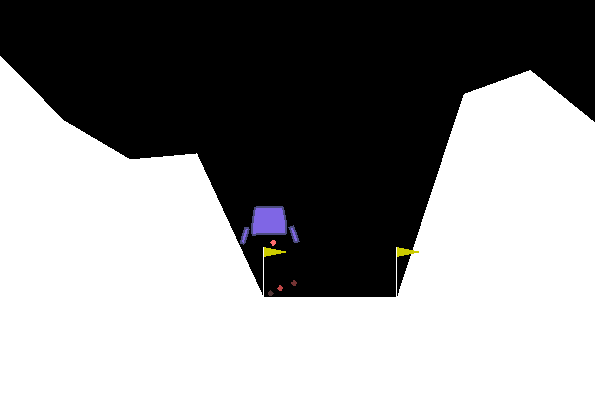 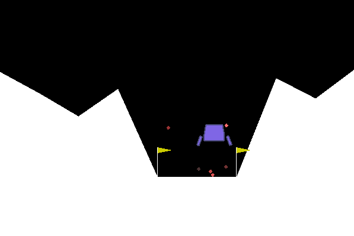 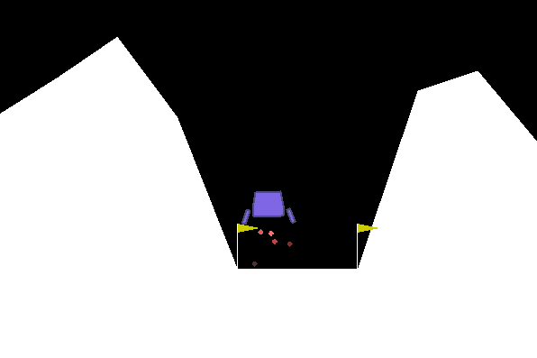

# Training the RL Agent
We evaluate the generalizability of the agent by comparing across 3 conditions:  
* Using only 10 original levels 
* Using 10 original levels + 40 levels that are randomly sampled from a uniform distribution
* 10 original levels + 40 levels sampled from the GAN 
  
We reason that in more realistic scenarios, it may be difficult to create levels by hand, so we treat original levels as a scarse resource. Sampling from a GAN that approximates the true distribution of levels, however, is inexpensive, so we can have many more levels from a GAN. To make sure that it is not simply the inclusion of more diverse levels that increases the generalizability of the RL agent, we have our third condition which samples additional levels from a distribution that is not the same as the original distribution. This is akin to just randomly filling a game level with random assets that do not necessarily fulfil the game designers' stylistic criteria (in real-life these criteria are listed in internal style guides and are important for establishing the brand of a game).

To select the RL agent, we used different techniques for randomly-generated levels to see which algorithm is best at learning the task of playing Lunar Lander. We compared across Vanilla Policy Gradients, Advantage Actor-Critic, and Proximal Policy Optimization. Training curves for each method are shown below:

    <b>Fig. 7.</b> Illustrative training curves from each algorithm: 
    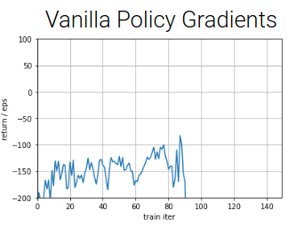 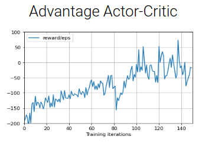 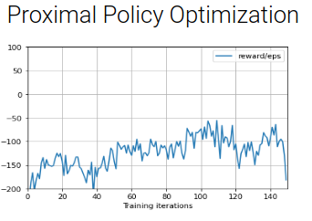

We found that under several different initializations, A2C had the best maximum performance, and did not run into as many catastrophic failures over time.

We vary the number of training steps per level and how many levels were loaded, such that there were always 600,000 training steps (from previous experiments, peak values most often occurred before 300,000 timesteps and were not surpassed afterward). In addition, to take randomness into account, each experiment was conducted with five different seeds to calculate the mean and standard deviation. The detailed results are shown below:

|  | 60 level loads; 10,000 timesteps per level | 100 level loads; 6,000 timesteps per level | 300 level loads; 2,000 timesteps per level | 600 level loads; 1,000 timesteps per level | 1000 level loads; 600 timesteps per level |
|-|-|-|-|-|-|
| 10 Original Levels (Original) | -63.96  +-  23.63 | -49.08  +-  25.20 | -29.27  +-  22.89 | -96.85  +-  13.03 | -51.61  +-  23.89 |
| 10 Original + 40 GAN-generated (Combined) | **-17.66  +-  12.30** | **9.27  +-  23.11** | **0.08  +-  38.19** | **38.61  +-  58.06** | -30.21  +-  13.77 |
| 10 Original + 40 "Random" Levels (Random) | -18.91  +-  10.18 | -46.99  +-  41.83 | -24.02  +-  22.34 | -46.07  +-  18.25 | **-29.85  +-  29.28** |

As shown in the table above, in four out of five experiments, the RL agents trained on both original and GAN-generated levels outperformed the two baseline: 1) RL agent trained on only the orignal levels (Random), and 2) RL agent trained on both original and random levels. In the experiment with 1000 levels and 600 training timestamp, the proposed RL agents performed slightly worse than the RL baseline with random levels.

# Code and Resources
- [Drive with GAN code and generated data](https://drive.google.com/drive/folders/1ZU8QwG1WK8pGDoHGHVkUil-lqrs0Fz6P?usp=sharing)
- [Game repository](https://github.com/openai/gym/blob/master/gym/envs/box2d/lunar_lander.py)
